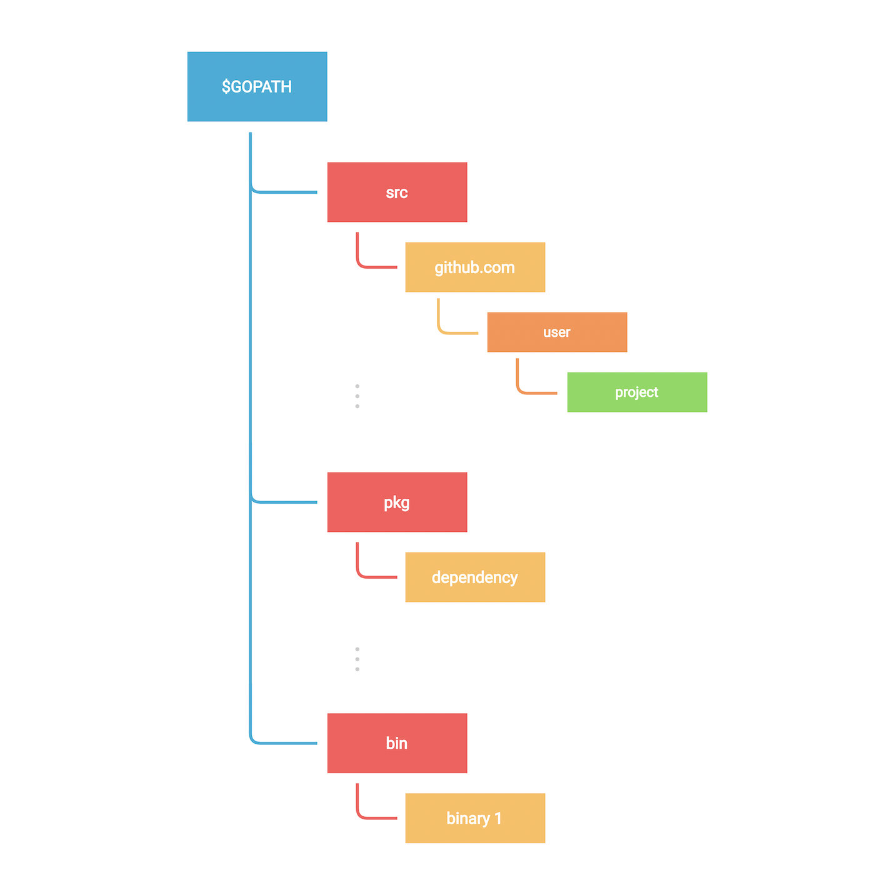

# Modules
Trong bài hướng dẫn này, chúng ta sẽ tìm hiểu về **Modules**.

## Modules là gì?
Giải thích một cách đơn giản, một **Module** là tập hợp các **Go packages** được lưu trữ trong một cây thư mục (file tree) với file `go.mod` nằm ở thư mục gốc (root), với điều kiện thư mục này nằm ngoài `$GOPATH/src`.

Go modules được giới thiệu từ phiên bản Go 1.11, mang lại khả năng hỗ trợ mặc định cho việc quản lý phiên bản (versioning) và module. Trước đây, chúng ta cần sử dụng flag `GO111MODULE=on` để bật tính năng module khi nó còn đang ở giai đoạn thử nghiệm. Tuy nhiên, kể từ phiên bản Go 1.13 trở đi, chế độ module đã trở thành mặc định cho mọi hoạt động phát triển.

## Chờ đã, GOPATH là gì?
**GOPATH** là một biến môi trường xác định thư mục gốc của không gian làm việc (workspace) của bạn, nó bao gồm các thư mục sau:

- **src**: Chứa mã nguồn Go được tổ chức theo cấu trúc phân cấp.
- **pkg**: Chứa mã nguồn của các package đã được biên dịch.
- **bin**: Chứa các file thực thi (binaries/executables) đã được biên dịch.



Tương tự như trước, hãy tạo một module mới bằng lệnh `go mod init`. Lệnh này sẽ tạo ra một module mới và khởi tạo file `go.mod` để mô tả về module đó.

```bash
$ go mod init example
```

Một điều quan trọng cần lưu ý là một Go module có thể tương ứng với một **Github repository** nếu bạn có kế hoạch xuất bản (publish) module này. Ví dụ:

```bash
$ go mod init github.com/username/project
```

Bây giờ, hãy cùng khám phá `go.mod`. Đây là file định nghĩa đường dẫn module (module path) - cũng là đường dẫn import được sử dụng cho thư mục gốc, cùng với các yêu cầu về **dependency** (thư viện phụ thuộc) của nó.

```bash
module <name>

go <version>

require (
	...
)
```

Nếu muốn thêm một dependency mới, chúng ta sẽ sử dụng lệnh `go get` (thay vì `go install` vốn dùng để cài đặt binary):

```bash
$ go get github.com/rs/zerolog
```

Bạn sẽ thấy một file `go.sum` cũng được tạo ra. File này chứa các mã băm (hashes) để kiểm tra tính toàn vẹn của nội dung các module mới.

Chúng ta có thể liệt kê tất cả các dependencies bằng lệnh `go list` như sau:

```bash
$ go list -m all
```

Nếu một dependency không còn được sử dụng, chúng ta có thể loại bỏ nó một cách dễ dàng bằng lệnh `go mod tidy`:

```bash
$ go mod tidy
```

## Vendoring
Để kết thúc phần thảo luận về modules, hãy cùng nói về **Vendoring**.

**Vendoring** là việc tạo ra một bản sao cục bộ của các package bên thứ ba (3rd party packages) mà dự án của bạn đang sử dụng. Những bản sao này theo truyền thống sẽ được đặt bên trong chính dự án và được lưu trữ cùng với mã nguồn trong repository của dự án.

Việc này có thể được thực hiện thông qua lệnh `go mod vendor`.

Hãy thử cài đặt lại module đã xóa bằng `go mod tidy` và sử dụng nó trong code:

```go
package main

import "github.com/rs/zerolog/log"

func main() {
	log.Info().Msg("Hello")
}
```

```bash
$ go mod tidy
go: finding module for package github.com/rs/zerolog/log
go: found github.com/rs/zerolog/log in github.com/rs/zerolog v1.26.1
$ go mod vendor
```

Sau khi chạy lệnh `go mod vendor`, một thư mục `vendor` sẽ được tạo ra với cấu trúc như sau:

```text
├── go.mod
├── go.sum
├── go.work
├── main.go
└── vendor
    ├── github.com
    │   └── rs
    │       └── zerolog
    │           └── ...
    └── modules.txt
```