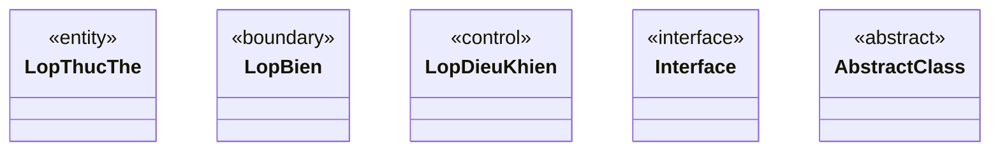
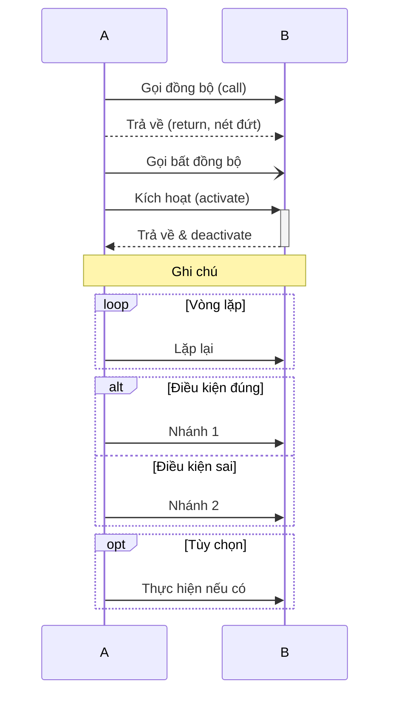
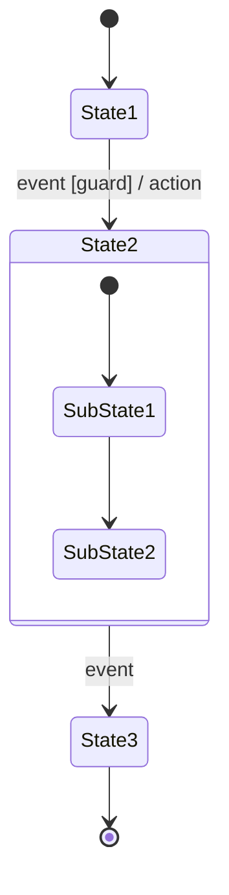
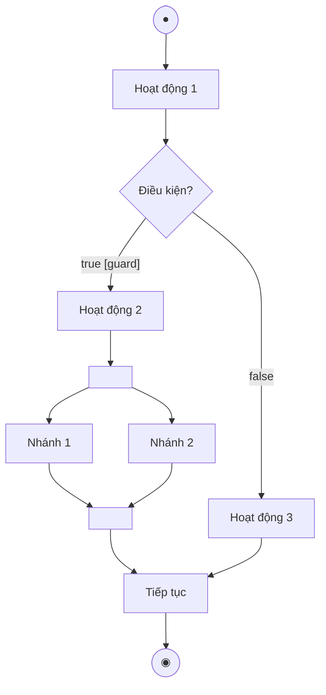

# CHEATSHEET: Ký hiệu UML và Mermaid tương ứng

## 1. Quan hệ trong Class Diagram

| Loại quan hệ | Mô tả | Mermaid syntax |
|---|---|---|
| Association | Liên kết đơn giản giữa 2 lớp | `A -- B` |
| Directed Association | Liên kết có hướng | `A --> B` |
| Inheritance (Generalization) | Kế thừa (con → cha) | `A <|-- B` (B kế thừa A) |
| Realization | Thực thi interface | `A <|.. B` |
| Dependency | Phụ thuộc | `A <.. B` |
| Aggregation | Cộng hợp (A là phần của B, A tồn tại độc lập) | `B o-- A` |
| Composition | Gắn chặt (A là phần của B, A không tồn tại độc lập) | `B *-- A` |

**Ghi chú số lượng:**
```
A "1" --> "n" B : label
A "0..1" --> "1..*" B
```

---

## 2. Các kiểu lớp đặc biệt



---

## 3. Use Case — Quan hệ giữa các UC

```
%% Include: A phải thực hiện B
UC_A ..> UC_B : <<include>>

%% Extend: B tùy chọn mở rộng A
UC_B ..> UC_A : <<extend>>

%% Generalization: UC_Con kế thừa UC_Cha
UC_Cha <|-- UC_Con
```

---

## 4. Sequence Diagram — Các loại message



---

## 5. State Machine — Cú pháp



---

## 6. Activity Diagram — Cú pháp đầy đủ



---

## 7. Ký hiệu phạm vi (Visibility)

| Ký hiệu | Tên | Mô tả |
|---|---|---|
| `+` | public | Truy cập từ mọi nơi |
| `-` | private | Chỉ trong lớp |
| `#` | protected | Trong lớp và lớp con |
| `~` | package | Trong cùng package |

---

## 8. Cú pháp thuộc tính và phương thức

**Thuộc tính:**
```
phạm_vi tên : kiểu [số_lượng] = mặc_định
```
Ví dụ: `- ngaySinh : Date[1] = "01-01-2000"`

**Phương thức:**
```
phạm_vi tên(tham_so : kiểu) : kiểu_tra_ve
```
Ví dụ: `+ tinhDiem(monHocId : int) : float`

---

## 9. CSDL — Quy tắc đặt tên

| Đối tượng | Quy tắc | Ví dụ |
|---|---|---|
| Tên bảng | `tbl` + TenLop | `tblSinhVien` |
| Khóa chính | `id` | `id` (int, auto increment) |
| Khóa ngoại | `tbl{A}id` | `tblKhoaid` |
| Cột thông thường | camelCase | `hoTen`, `ngaySinh` |

---

## 10. Bảng kiểu dữ liệu Java → SQL

| Java | MySQL |
|---|---|
| `String` | `VARCHAR(n)` |
| `int` / `Integer` | `INT` |
| `float` / `Float` | `FLOAT` |
| `double` / `Double` | `DOUBLE` |
| `Date` | `DATE` |
| `boolean` / `Boolean` | `TINYINT(1)` |
| `long` / `Long` | `BIGINT` |