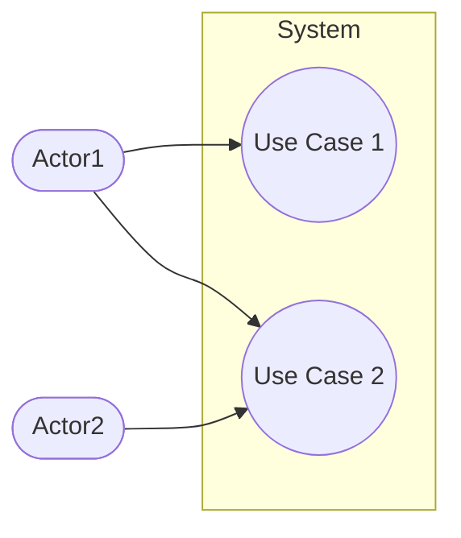
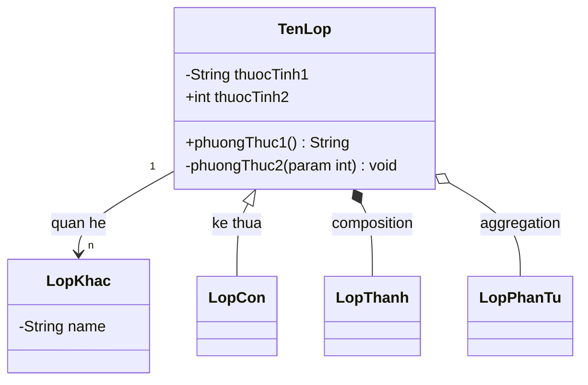
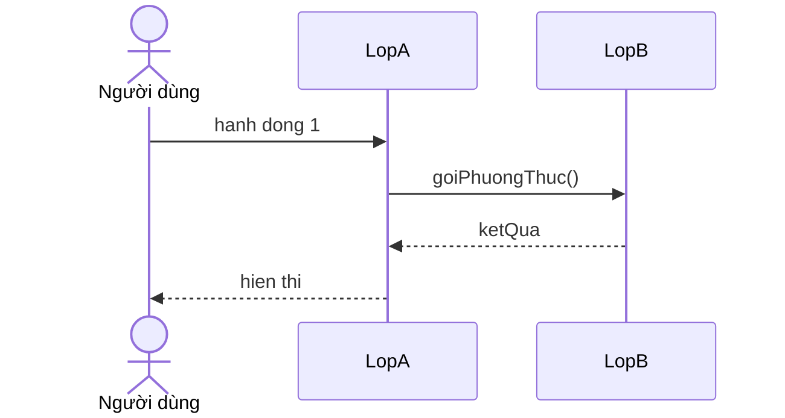
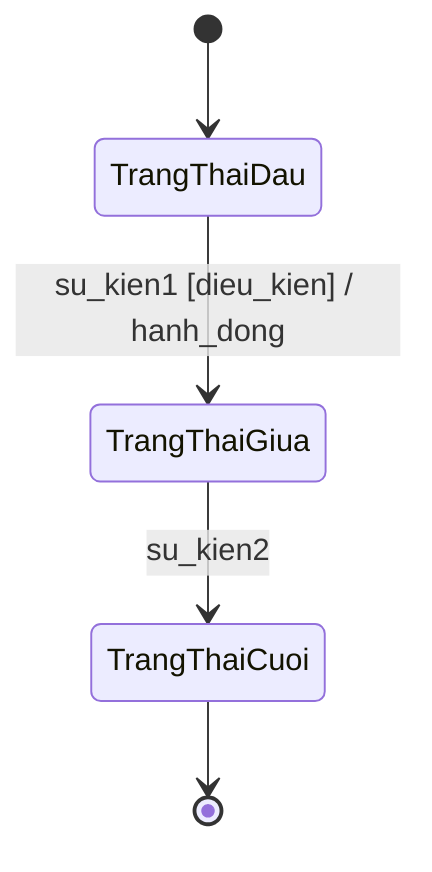
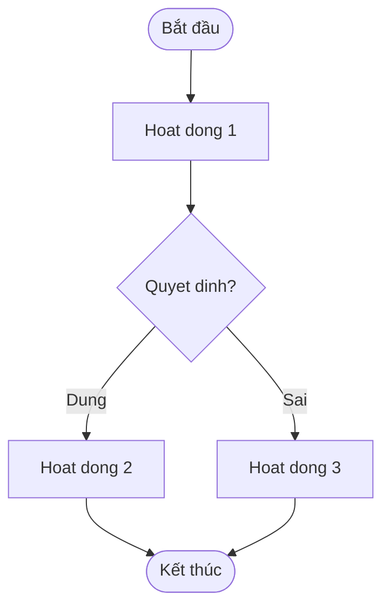
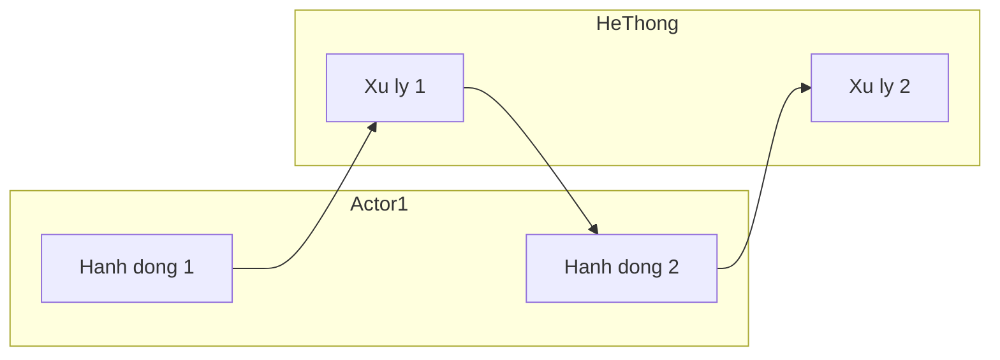
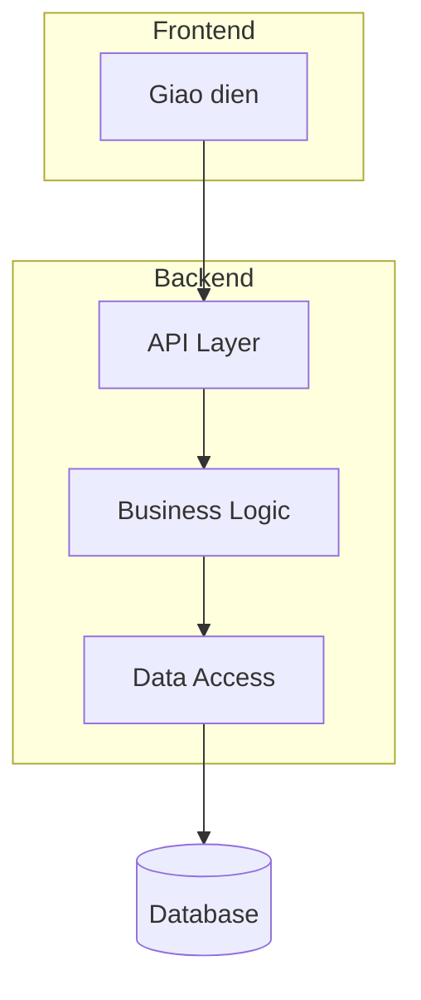
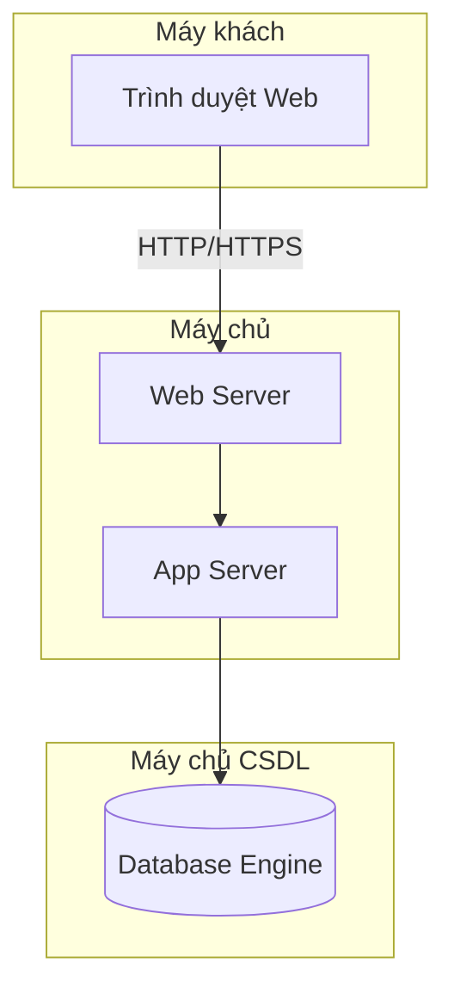

# SKILL: Thiết kế và vẽ sơ đồ theo chuẩn CNPM

## Mô tả
Skill này hướng dẫn agent thiết kế và sinh code Mermaid cho các loại sơ đồ UML theo đúng
quy trình phân tích - thiết kế phần mềm hướng đối tượng bài bản, dựa trên
giáo trình "Phân tích Thiết kế - Đảm bảo Chất lượng Phần mềm" (Nguyễn Mạnh Hùng, Đỗ Thị
Bích Ngọc, 2020).

## Khi nào dùng skill này
- Người dùng yêu cầu vẽ sơ đồ UML cho một hệ thống phần mềm
- Người dùng cần phân tích yêu cầu, thiết kế hệ thống theo quy trình OOAD
- Người dùng cần sinh các biểu đồ từ đặc tả hoặc kịch bản nghiệp vụ

---

## PHẦN 1: QUY TRÌNH BẮT BUỘC TRƯỚC KHI VẼ

Trước khi vẽ bất kỳ sơ đồ nào, agent phải xác định:

1. **Pha nào trong vòng đời phần mềm?**
   - Pha thu thập/phân tích yêu cầu → vẽ Use Case Diagram, Activity Diagram (phân tích)
   - Pha phân tích → vẽ Class Diagram (phân tích), Sequence/Collaboration Diagram (phân tích)
   - Pha thiết kế → vẽ Class Diagram (thiết kế), Sequence Diagram (thiết kế), Component, Deployment
   - Pha cài đặt → vẽ Package Diagram

2. **Mức độ chi tiết nào?**
   - Tổng quan (overview) hay chi tiết (detail) cho một module cụ thể?

3. **Loại sơ đồ phù hợp?** → Xem bảng chọn sơ đồ bên dưới

---

## PHẦN 2: BẢNG CHỌN LOẠI SƠ ĐỒ

| Mục tiêu | Sơ đồ phù hợp |
|---|---|
| Mô tả chức năng hệ thống, ai dùng gì | Use Case Diagram |
| Mô tả luồng hoạt động nghiệp vụ | Activity Diagram |
| Mô tả các lớp và quan hệ (phân tích) | Class Diagram (analysis) |
| Mô tả các lớp và quan hệ (thiết kế) | Class Diagram (design) |
| Mô tả trình tự tương tác theo thời gian | Sequence Diagram |
| Mô tả vai trò các đối tượng trong tương tác | Collaboration Diagram |
| Mô tả trạng thái của đối tượng | State Machine Diagram |
| Mô tả kiến trúc thành phần phần mềm | Component Diagram |
| Mô tả triển khai vật lý hệ thống | Deployment Diagram |
| Mô tả tổ chức các gói/package | Package Diagram |

---

## PHẦN 3: RULES CHO TỪNG LOẠI SƠ ĐỒ

### 3.1 Use Case Diagram

**Quy tắc bắt buộc:**
- Actor phải là danh từ chỉ người dùng hoặc hệ thống ngoài tương tác trực tiếp với hệ thống
- Tên Use Case PHẢI là động từ chỉ hành động của actor, KHÔNG phải hành động của hệ thống
  - ✅ Đúng: "Đăng kí học", "Nhập điểm", "Xem thống kê"
  - ❌ Sai: "Hiển thị danh sách môn học", "Lưu điểm vào CSDL"
- Mỗi Use Case phải có ít nhất một actor tương tác (trực tiếp hoặc gián tiếp)
- Nếu 2 actor có chức năng chung → dùng actor trừu tượng (cha) để kế thừa
- Nếu 2 use case trùng nhau → gộp lại hoặc dùng use case trừu tượng

**Quan hệ giữa Use Case:**
- `<<include>>`: UC A luôn phải thực hiện UC B để hoàn thành (bắt buộc)
- `<<extend>>`: UC B là tùy chọn mở rộng từ UC A (không bắt buộc)
- `generalization`: UC con kế thừa từ UC cha

**Quy trình vẽ Use Case tổng quan:**
1. Trích actor từ danh sách người dùng trong đặc tả
2. Trích use case từ danh sách chức năng của từng actor
3. Xét actor nào có chức năng chung → kế thừa
4. Xét use case nào trùng nhau → gộp hoặc dùng abstract use case

**Quy trình vẽ Use Case chi tiết (cho 1 module):**
1. Trích phần use case tương ứng từ sơ đồ tổng quan
2. Phân rã use case chính thành các use case con (mỗi giao diện tương tác = 1 use case con)
3. Xác định quan hệ: generalization / include / extend
4. Gộp các use case con tương tự bằng abstract use case

---

### 3.2 Class Diagram

#### 3.2.1 Biểu đồ lớp thực thể (Pha Phân tích)

**Quy tắc trích danh từ:**
1. Viết mô tả hệ thống bằng đoạn văn đầy đủ
2. Trích các danh từ xuất hiện (mỗi danh từ tính 1 lần)
3. Đánh giá từng danh từ:
   - Đề xuất thành **lớp thực thể** nếu là thực thể chính của hệ thống
   - Đề xuất thành **thuộc tính** nếu là đặc điểm của lớp khác
   - **Loại bỏ** nếu quá trừu tượng, chung chung, hoặc ngoài phạm vi

**Quy tắc về quan hệ số lượng:**
- Quan hệ 1-1: có thể gộp lại hoặc giữ nguyên
- Quan hệ 1-n: giữ nguyên
- Quan hệ **n-n**: BẮT BUỘC phải đề xuất lớp thực thể trung gian để tách thành 2 quan hệ 1-n

**Lưu ý khi vẽ:**
- Tên lớp, tên thuộc tính nên đặt theo code convention (không dấu, không cách)
- Pha phân tích: thuộc tính chưa cần kiểu dữ liệu
- Pha phân tích: các lớp thực thể chưa cần thuộc tính id

#### 3.2.2 Biểu đồ lớp pha Thiết kế (Lớp thực thể)

**Quy trình từ phân tích sang thiết kế:**
1. Bổ sung thuộc tính `id` cho các lớp không kế thừa từ lớp khác
2. Bổ sung kiểu dữ liệu cho tất cả thuộc tính (theo ngôn ngữ lập trình đã chọn)
3. Chuyển đổi quan hệ association sang aggregation/composition:
   - Nếu A và B liên kết tạo C → C chứa A và B, hoặc A chứa C (C chứa B)
4. Bổ sung thuộc tính đối tượng tường minh cho quan hệ aggregation/composition

**Ký hiệu phạm vi thuộc tính/phương thức:**
- `+` : public
- `#` : protected
- `-` : private
- `~` : package (cùng package)

**Các kiểu lớp đặc biệt trong UML:**
- **Lớp thực thể**: lưu trữ thông tin về đối tượng nghiệp vụ
- **Lớp biên (Boundary)**: nằm ở ranh giới hệ thống, nhận yêu cầu từ actor
- **Lớp điều khiển (Control)**: điều khiển luồng xử lý của một use case

#### 3.2.3 Biểu đồ lớp pha Thiết kế chi tiết (toàn bộ layers)

**Quy trình:**
1. Thiết kế giao diện (UI) cho các màn hình xuất hiện trong biểu đồ lớp phân tích
2. Đề xuất các lớp giao diện tương ứng với nền tảng (JSP/React/Android...)
3. Đề xuất các lớp DAO (Data Access Object) cho thao tác CSDL
   - Lớp DAO nên dạng interface hoặc kế thừa lớp trừu tượng để dùng chung kết nối
   - Nếu lớp thực thể cần phương thức → đề xuất lớp DAO tương ứng
4. Bổ sung các lớp thực thể liên quan, giữ nguyên quan hệ như biểu đồ thực thể

---

### 3.3 Activity Diagram (Biểu đồ hoạt động)

**Quy tắc:**
- Mỗi trạng thái chờ = mỗi lần hệ thống hiển thị giao diện để chờ tương tác
- Điều kiện chuyển trạng thái = hành động của người dùng trên giao diện
- Dùng swimlane khi có nhiều lớp/actor tham gia
- Sử dụng thanh đồng bộ (synchronization bar) khi có hoạt động song song

**Các thành phần cơ bản:**
- Trạng thái khởi đầu: hình tròn đặc
- Trạng thái kết thúc: hai hình tròn lồng nhau
- Hoạt động: hình chữ nhật bo góc
- Quyết định: hình thoi
- Thanh đồng bộ nằm ngang/dọc

---

### 3.4 Sequence Diagram (Biểu đồ tuần tự)

**Kịch bản v.2 (pha phân tích):**
- Mỗi bước là hành động của một lớp trong biểu đồ lớp hoặc của actor
- Tên hành động dùng ngôn ngữ tự nhiên

**Kịch bản v.3 (pha thiết kế):**
- Tên hành động phải khớp với phương thức đã thiết kế trong biểu đồ lớp
- Biểu diễn phạm vi và khoảng thời gian hoạt động của từng phương thức

**Các dạng message:**
| Loại | Mô tả | Mermaid |
|---|---|---|
| call | Lời gọi phương thức | `A->>B: method()` |
| return | Trả về giá trị | `B-->>A: result` |
| create | Tạo đối tượng | `A->>+B: <<create>>` |
| destroy | Hủy đối tượng | `A->>-B: <<destroy>>` |

---

### 3.5 State Machine Diagram (Biểu đồ trạng thái)

**Quy tắc:**
- Mỗi lớp (trừ lớp trừu tượng) thường có một biểu đồ trạng thái
- Hai loại:
  - **Biểu đồ trạng thái cho một use case**: trạng thái của đối tượng trong 1 use case cụ thể
  - **Biểu đồ trạng thái hệ thống**: tất cả trạng thái của đối tượng trong toàn hệ thống

**Các loại sự kiện:**
- **Call event**: yêu cầu thực hiện một phương thức
- **Signal event**: gửi thông điệp giữa các trạng thái
- **Time event**: chuyển tiếp theo thời gian

---

### 3.6 Component Diagram

**Nguyên tắc:**
- Mỗi thành phần là một phần mềm nhỏ hơn, dạng hộp đen
- Các thành phần trao đổi qua giao tiếp (interface)
- Có thể dùng package để nhóm các thành phần

---

### 3.7 Deployment Diagram

**Nguyên tắc:**
- Node/Device: thành phần không có bộ vi xử lý
- Processor: thành phần có bộ vi xử lý
- Các liên kết mô tả giao thức truyền thông (TCP/IP, HTTP...)

---

### 3.8 Package Diagram (Thiết kế triển khai)

**Cấu trúc package điển hình (Java Web):**
```
project/
├── model/     → Các lớp thực thể
├── dao/       → Các lớp Data Access Object
└── view/      → Các trang giao diện (JSP/HTML)
    ├── thanhvien/   → Màn hình đăng nhập, đổi mật khẩu
    ├── sinhvien/    → Chức năng sinh viên
    ├── giangvien/   → Chức năng giảng viên
    └── quanli/      → Chức năng quản lý
```

---

## PHẦN 4: THIẾT KẾ CSDL

**Quy trình từ Class Diagram sang CSDL:**
1. Mỗi lớp thực thể → 1 bảng dữ liệu (ví dụ: lớp `Student` → bảng `tblStudent`)
2. Thuộc tính kiểu cơ bản (không phải object) → cột của bảng, chuyển kiểu theo DBMS
3. Quan hệ số lượng giữa lớp = quan hệ giữa bảng:
   - 1-1: có thể gộp lại
   - 1-n: giữ nguyên
   - n-n: bổ sung bảng trung gian
4. Bổ sung khóa:
   - **Khóa chính (PK)**: bảng nào có thuộc tính `id` → thiết lập làm PK
   - **Khóa ngoại (FK)**: quan hệ 1-n (A có n B) → bảng B có FK tham chiếu PK của A
5. Loại bỏ thuộc tính dư thừa:
   - Thuộc tính bị trùng lặp giữa các bảng
   - Thuộc tính **dẫn xuất** (có thể tính từ các thuộc tính khác)

---

## PHẦN 5: ĐỊNH DẠNG OUTPUT MERMAID

### Use Case Diagram


### Class Diagram


### Sequence Diagram


### State Machine Diagram


### Activity Diagram


### Activity Diagram với Swimlane


### Component Diagram


### Deployment Diagram


---

## PHẦN 6: CHECKLIST KIỂM TRA SƠ ĐỒ

Trước khi trả về sơ đồ, agent phải tự kiểm tra:

### Use Case Diagram
- [ ] Tên use case là động từ hành động của actor (không phải hệ thống)?
- [ ] Mỗi use case có ít nhất một actor tương tác?
- [ ] Không có use case nào "trôi nổi" không liên kết?
- [ ] Quan hệ include/extend đúng chiều mũi tên?
- [ ] Đã xử lý các use case trùng nhau bằng abstract use case?

### Class Diagram (Phân tích)
- [ ] Đã xử lý hết các quan hệ n-n bằng lớp trung gian?
- [ ] Thuộc tính là danh từ mô tả đặc điểm lớp (không phải id)?
- [ ] Tên lớp theo PascalCase, tên thuộc tính theo camelCase?
- [ ] Quan hệ kế thừa đúng hướng (mũi tên từ con lên cha)?

### Class Diagram (Thiết kế)
- [ ] Đã bổ sung id cho các lớp không kế thừa?
- [ ] Đã bổ sung kiểu dữ liệu cho tất cả thuộc tính?
- [ ] Đã chuyển association thành aggregation/composition phù hợp?
- [ ] Các lớp DAO tương ứng với lớp thực thể có phương thức?

### Sequence Diagram
- [ ] Tên phương thức khớp với Class Diagram?
- [ ] Đúng thứ tự thời gian (từ trên xuống dưới)?
- [ ] Có lifeline cho mỗi đối tượng?
- [ ] Có message trả về cho các lời gọi quan trọng?

### State Machine Diagram
- [ ] Có trạng thái khởi đầu và kết thúc?
- [ ] Mỗi chuyển tiếp có nhãn sự kiện?
- [ ] Không có trạng thái "chết" (không thể thoát ra)?

---

## PHẦN 7: LỖI PHỔ BIẾN CẦN TRÁNH

1. **Use Case**: Đặt tên use case là hành động của hệ thống ("Hiển thị danh sách", "Lưu vào DB")
2. **Use Case**: Vẽ actor tương tác trực tiếp với use case extend (phải qua use case gốc)
3. **Class Diagram**: Để quan hệ n-n mà không tạo lớp trung gian
4. **Class Diagram**: Quên bổ sung id và kiểu dữ liệu khi chuyển sang pha thiết kế
5. **Sequence Diagram**: Tên phương thức ở kịch bản v.3 không khớp với Class Diagram thiết kế
6. **CSDL**: Không loại bỏ thuộc tính dẫn xuất (ví dụ: điểm trung bình có thể tính được)
7. **Activity Diagram**: Không có điều kiện guard trên các nhánh quyết định