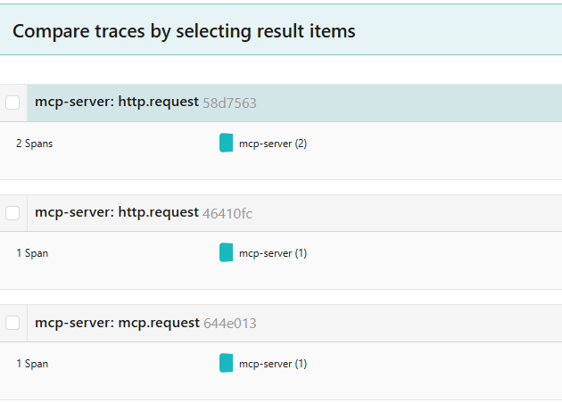
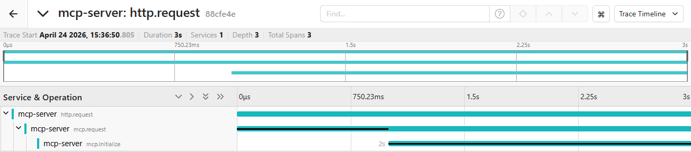

# 🕵️ MCP Server Observability với Jaeger

Hệ thống này sử dụng **Model Context Protocol (MCP)** kết hợp với **OpenTelemetry** để cung cấp khả năng giám sát toàn diện (Observability). Trọng tâm của cơ chế này là việc quản lý và truyền dẫn `context.Context` xuyên suốt các tầng xử lý.

## 1. Cơ chế Truyền dẫn Context (Context Propagation)

Để Jaeger có thể xâu chuỗi các hoạt động từ lúc Request HTTP đi vào cho đến khi Tool được thực thi, chúng ta áp dụng nguyên tắc **"Không bao giờ làm đứt xích Context"**.

### Luồng đi của dữ liệu:
1.  **Tracing Middleware:**
    * Trích xuất `TraceID` từ HTTP Header (nếu có) hoặc khởi tạo mới.
    * Tạo Span cha: `http.request`.
    * **Quan trọng:** Sử dụng `r.WithContext(ctx)` để gắn TraceID vào Request trước khi chuyển cho Handler tiếp theo.
2.  **MCP Handler (`ServeHTTP`):**
    * Lấy Context ra bằng `r.Context()`.
    * Tạo Span con: `mcp.request`.
    * Truyền `ctx` này vào các hàm nghiệp vụ như `handleInitialize`, `handleToolsCall`.
3.  **Hàm nghiệp vụ (Tools/Resources):**
    * Sử dụng `ctx` nhận được để tạo các Span chi tiết hơn (ví dụ: `mcp.tool.call`).

---

## 2. Tại sao phải dùng `r.Context()` thay vì `context.Background()`?

Trong file `handler.go`, chúng ta tuyệt đối tránh dùng `context.Background()` bên trong các logic xử lý Request vì:

* ❌ **`context.Background()`**: Tạo ra một "tờ giấy trắng", làm mất TraceID từ Middleware truyền xuống. Jaeger sẽ hiển thị các Span rời rạc, không thể theo dõi luồng từ A-Z.
* ✅ **`r.Context()`**: Kế thừa toàn bộ "thẻ định danh" (TraceID, SpanID) từ các lớp bảo vệ bên ngoài, giúp Jaeger vẽ được biểu đồ thác nước (Waterfall) chính xác.

---

## 3. Cấu trúc Trace trên Jaeger

Khi cấu hình đúng, một request đơn lẻ sẽ hiển thị theo cấu trúc phân cấp như sau:

```text
[Span] http.request (Middleware - Ghi nhận thông tin HTTP)
  └── [Span] mcp.request (Handler - Phân loại yêu cầu JSON-RPC)
        └── [Span] mcp.tool.call (Logic - Thực thi Tool cụ thể)
              └── [Span] db.query (Database - Truy vấn dữ liệu nếu có)
```


- `http.request` không mất thời gian chạy hàm (0us) => không xuất hiện thanh đen bên trong span 
- `mcp.request` mất 1s => xuất hiện thanh đen dài 1s trên trong span 
- `mcp.initialize` mất 2s => xuất hiện thanh đen dài 2s kế tiếp span trên trong span 
---

## 4. Tích hợp Logging với TraceID

Hệ thống sử dụng **Structured Logging**. Nhờ vào việc truyền `ctx` xuyên suốt, mỗi dòng log được in ra sẽ đính kèm mã `trace_id`.

* **Tra cứu Log:** Bạn có thể copy `trace_id` từ một Span bị lỗi trên Jaeger và dán vào hệ thống lưu trữ Log (như ELK hoặc Grafana Loki) để xem chi tiết lỗi xảy ra lúc đó.

---

## 5. Hướng dẫn kiểm tra

1.  Khởi động Jaeger qua Docker:
    ```bash
    docker run -d --name jaeger \
      -e COLLECTOR_ZIPKIN_HOST_PORT=:9411 \
      -p 5775:5775/udp -p 6831:6831/udp -p 6832:6832/udp \
      -p 5778:5778 -p 16686:16686 -p 14268:14268 -p 14250:14250 -p 9411:9411 \
      jaegertracing/all-in-one:latest
    ```
2.  Gửi Request đến Server và truy cập `http://localhost:16686` để xem kết quả.

---

### 💡 Lưu ý cho lập trình viên:
Khi viết một hàm mới, hãy luôn đặt `ctx context.Context` làm tham số đầu tiên. Đây không chỉ là convention của Go, mà là cách chúng ta duy trì "mạch máu" thông tin cho hệ thống giám sát.